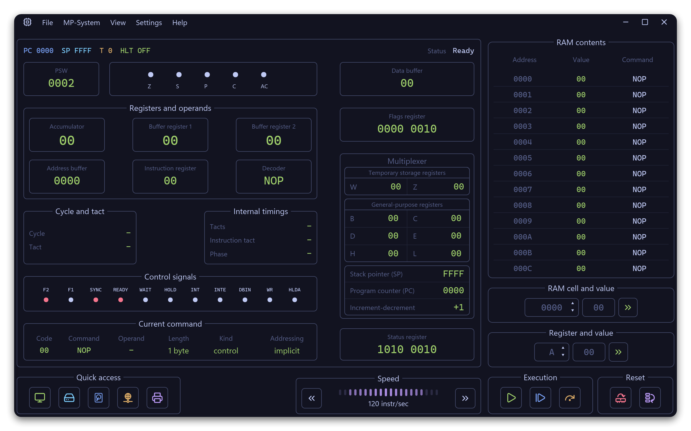
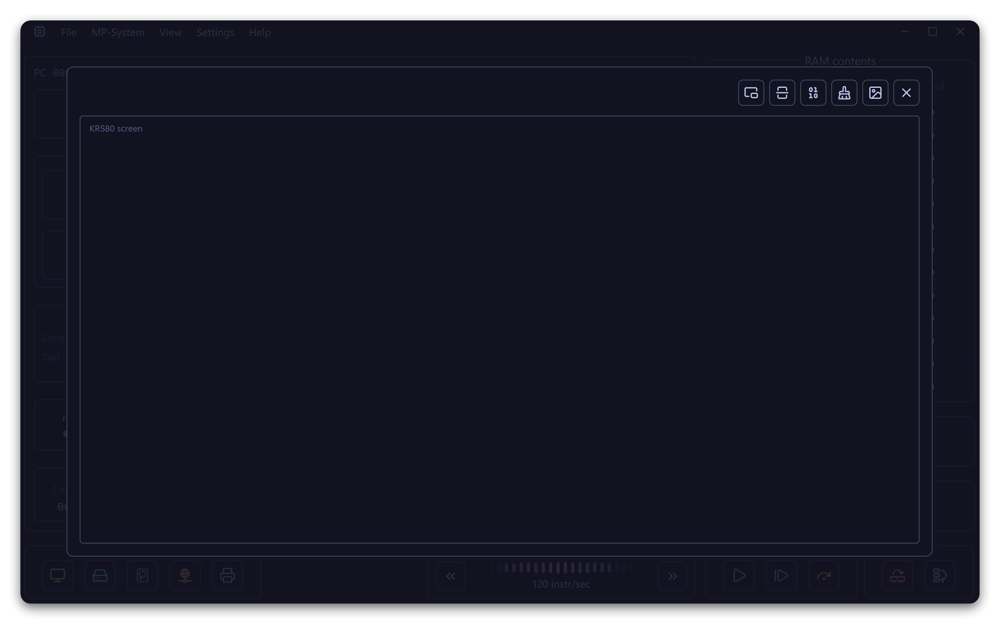
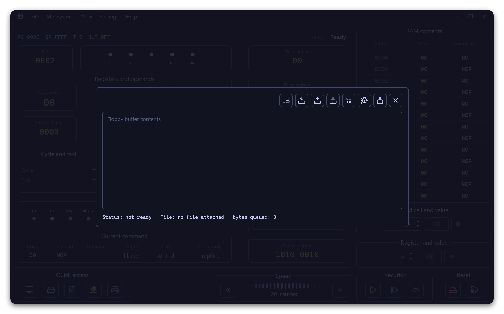
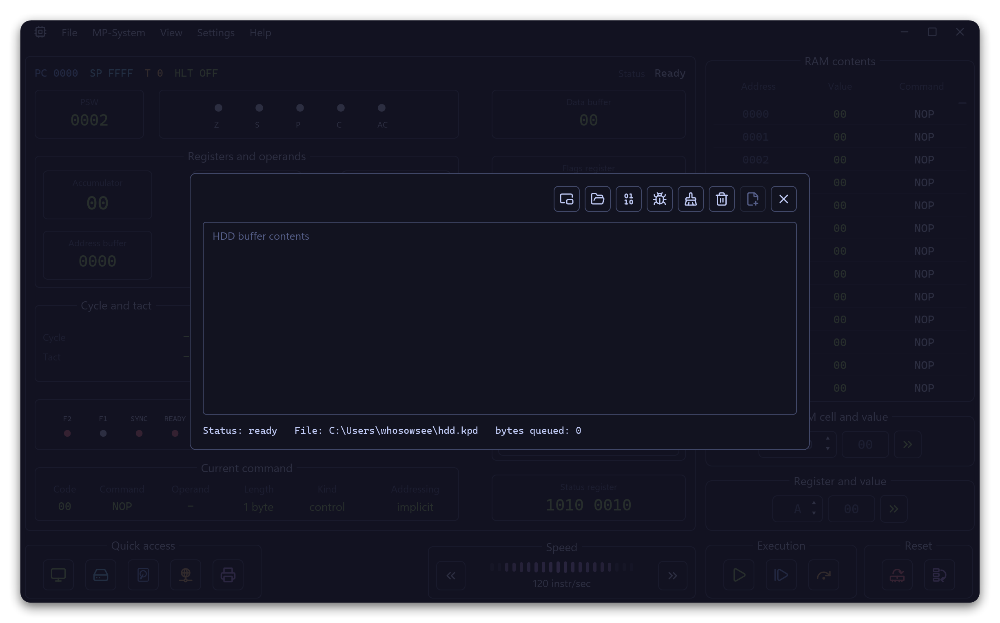
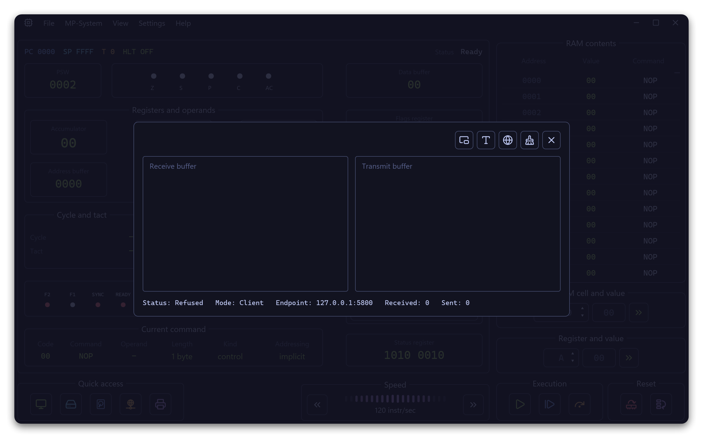
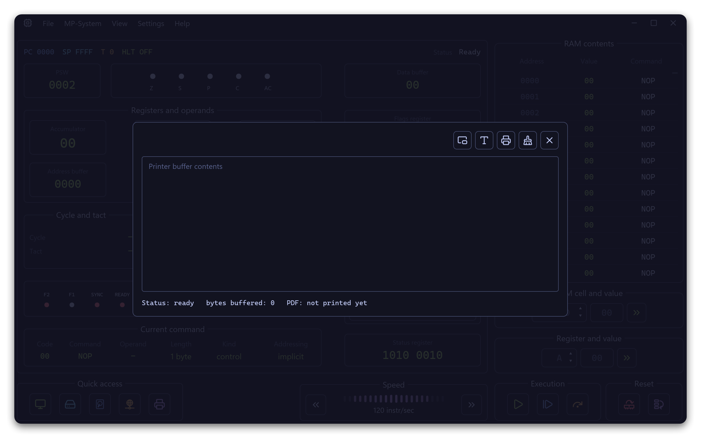

<p align="center">
  
</p>

<p align="center">
  <a href="https://github.com/WhoSowSee/KR580/graphs/contributors"></a>
  <a href="https://github.com/WhoSowSee/KR580/forks"></a>
  <a href="https://github.com/WhoSowSee/KR580/stargazers"></a>
</p>

<p align="center">
  <a href="https://crates.io/crates/kr580"></a>
  <a href="https://crates.io/crates/kr580"></a>
</p>

<h2 align="center">Desktop KR580 emulator written in Rust</h2>

<p align="center">
  
</p>

> [!TIP]
> **Russian version:** [README.md](README.md)

KR580 is a modern desktop emulator for a KR580 / Intel 8080-style microprocessor system. It keeps the CPU core deterministic, models external devices through typed I/O ports, and presents the machine through a native multi-window GUI.

The project focuses on inspectable execution: edit RAM and registers, step by instruction or by tact, watch the control panels update live, open device windows, save snapshots, and export state without scraping UI widgets.

## Features

- Deterministic KR580 / Intel 8080 CPU state: registers, flags, `PC`, `SP`, 64 KiB RAM, interrupts, halt state, cycles, and tact phase.
- Documented 8080 opcode execution with tests for opcode families, flags, conditionals, stack operations, interrupts, and I/O routing.
- Instruction stepping, tact-level stepping, paced run, and burst run modes.
- Native iced desktop UI with RAM list, register editor, status register, machine-cycle view, control schematic, and localized Russian/English installer text.
- External device windows for monitor, floppy, HDD, network adapter, and printer.
- Versioned `.580` snapshots, raw `.krs` subprogram loading, direct `.txt` / `.xlsx` import and export, and printer PDF generation.
- Graphical installer, uninstaller, terminal launcher, optional `.580` file association, and portable or system install layouts.

## Screenshots

<p align="center"><strong>Monitor</strong> · <strong>Floppy</strong></p>
<p align="center">
  
  
</p>

<p align="center"><strong>HDD</strong> · <strong>Network adapter</strong></p>
<p align="center">
  
  
</p>

<p align="center"><strong>Printer</strong></p>
<p align="center">
  
</p>

## External devices

`IoBus` routes the low byte of I/O port addresses to five modeled devices:

| Port | Device | What it does |
|---:|---|---|
| `00h` | Monitor | 64×20 text framebuffer plus 256×256 graphics layer. |
| `01h` | Floppy | File-backed or debug-buffer storage window. |
| `02h` | HDD | Append-backed `hdd.kpd` storage with visible buffer inspection. |
| `03h` | Network adapter | TCP client/server worker with RX/TX counters and explicit connection state. |
| `04h` | Printer | CP866 spool, buffered output, and asynchronous A4 PDF export. |

Device operations return typed statuses and errors. The CPU core talks to them only through `IN` / `OUT`, so emulator state stays serializable and testable.

## Installation

### Requirements

- Rust `1.95.0` or newer.
- A desktop environment capable of running native iced windows.

### Install from crates.io

```bash
cargo install kr580
```

This path is for the published crates.io release. Until the package is published, use the source build or the standalone setup artifact.

### Install on NixOS

```bash
nix run github:WhoSowSee/KR580
nix profile install github:WhoSowSee/KR580
```

The NixOS package installs ready-to-run `k580` and `kr` binaries, the desktop entry, icons, and the `.580` MIME type directly through the Nix store. The standalone setup wizard is not used for this path.

### Run from source

```bash
git clone https://github.com/WhoSowSee/KR580.git
cd KR580
cargo run -p k580-ui --bin k580
```

### Build the GUI binary

```bash
cargo build --release -p k580-ui --bin k580
```

The built application is placed under `target/release/` as `k580` or `k580.exe`.

### Build the standalone setup artifact

Windows:

```powershell
powershell -NoProfile -ExecutionPolicy Bypass -File scripts/build_installer.ps1
```

Unix/macOS:

```bash
bash scripts/build_installer.sh
```

The setup artifact is written to `dist/`.

## Usage

```bash
# Launch the emulator from source
cargo run -p k580-ui --bin k580

# Open a snapshot through the launcher
cargo run -p k580-ui --bin kr -- path/to/program.580

# Show launcher help
cargo run -p k580-ui --bin kr -- --help
```

After installation, `kr` can open `.580` snapshots from the terminal and can register or remove the file association when the platform supports it.

## File formats

| Format | Purpose |
|---|---|
| `.580` | Versioned little-endian emulator snapshot with magic `K580`. |
| `.krs` | Raw subprogram bytes loaded at a caller-provided base address. |
| `.txt` | Plain-text register, flag, and memory exports; also importable. |
| `.xlsx` | Workbook export/import through `rust_xlsxwriter` and `calamine`. |
| `.pdf` | Printer output rendered as A4 text with bundled Roboto Mono. |

## Workspace layout

| Crate | Responsibility |
|---|---|
| `k580-core` | CPU state, opcode decode/execute, timing, interrupts, and `PortBus`. |
| `k580-devices` | Monitor, floppy, HDD, network, printer, workers, and printer PDF output. |
| `k580-persistence` | Snapshots, settings, subprograms, TXT/XLSX import and export. |
| `k580-app` | Emulator actor, command/event wiring, state snapshots, and file commands. |
| `k580-ui` | Desktop UI, launcher, installer, uninstaller, and platform shims. |

## Development

```bash
cargo fmt --all
cargo clippy --workspace --all-targets -- -D warnings
cargo test --workspace
```

Useful reference docs:

- [Architecture](docs/architecture.md)
- [CPU core](docs/core.md)
- [Devices and IoBus](docs/devices.md)
- [Persistence](docs/persistence.md)
- [App and UI](docs/ui_app.md)
- [Installer](docs/installer.md)
- [Testing](docs/testing.md)
- [Assets](docs/assets.md)

## Star History

<p align="center">
  <a href="https://starchart.cc/WhoSowSee/KR580">
    <picture>
      <source
        media="(prefers-color-scheme: dark)"
        srcset="https://starchart.cc/WhoSowSee/KR580.svg?variant=custom&background=%230d1117&axis=%238b949e&line=%232f81f7"
      />
      <source
        media="(prefers-color-scheme: light)"
        srcset="https://starchart.cc/WhoSowSee/KR580.svg?variant=custom&background=%23ffffff&axis=%2357606a&line=%230969da"
      />
      
    </picture>
  </a>
</p>

<p align="center">
  
</p>

<p align="center">
  <i><code>&copy 2026-present <a href="https://github.com/WhoSowSee">WhoSowSee</a></code></i>
</p>

<div align="center">
  <a href="https://github.com/WhoSowSee/KR580/blob/main/LICENSE"></a>
</div>
