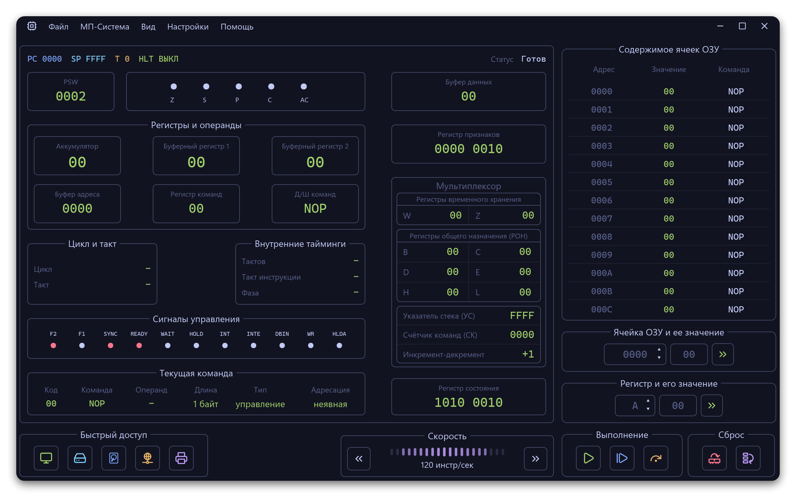
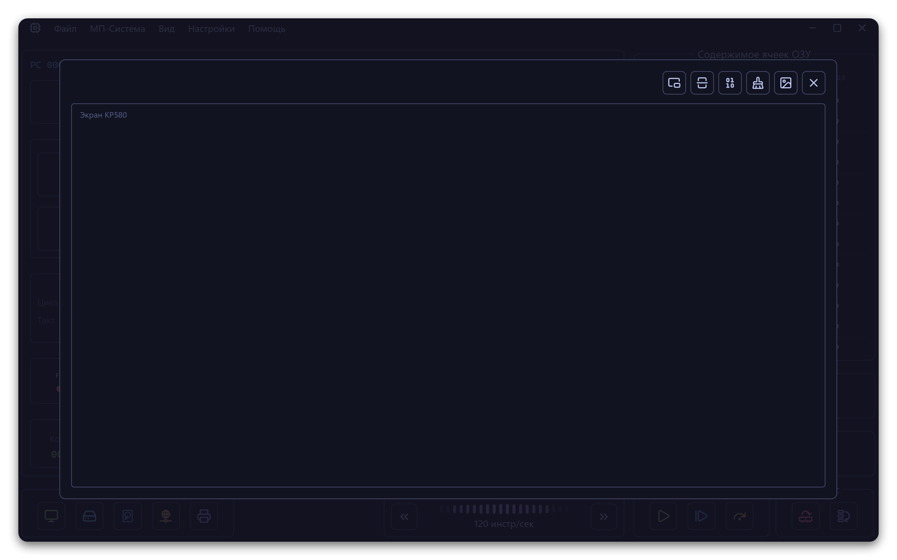
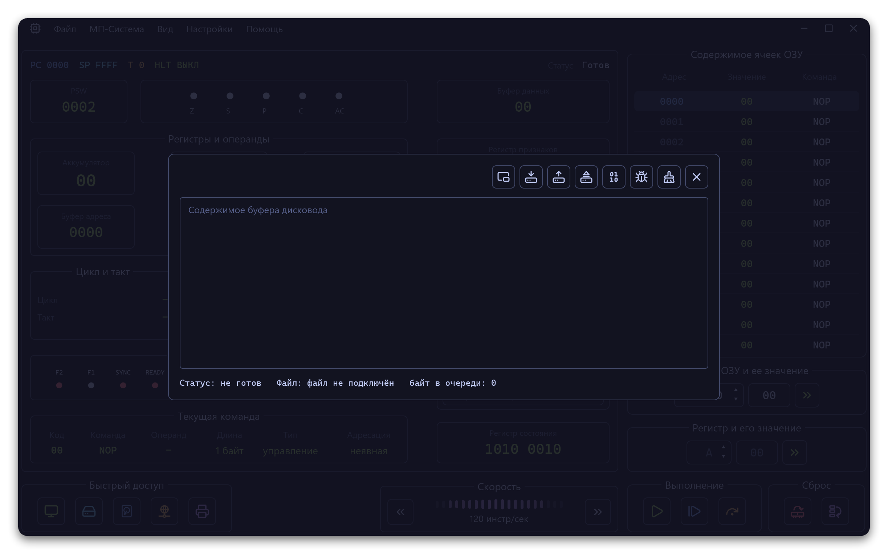
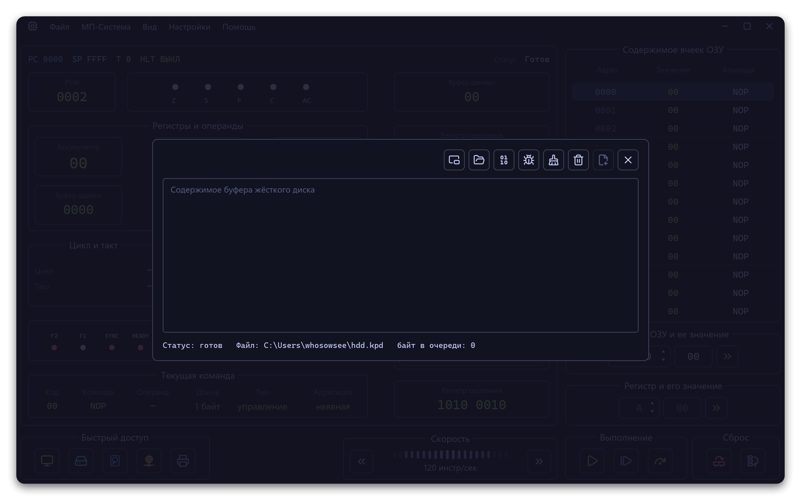
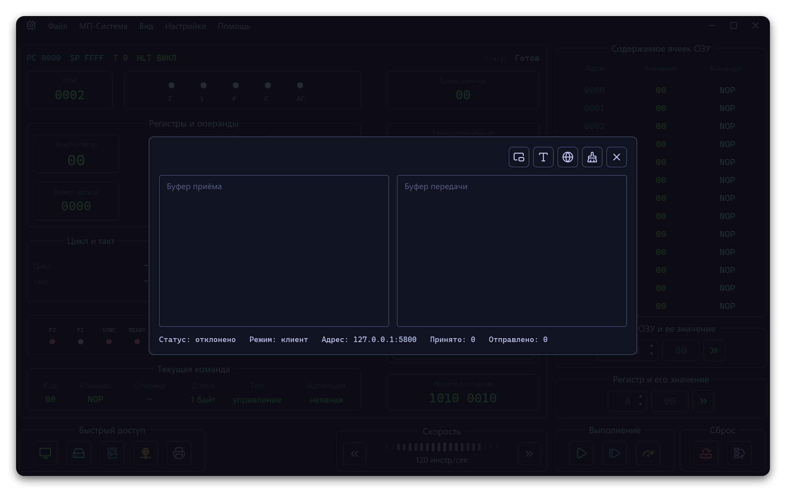
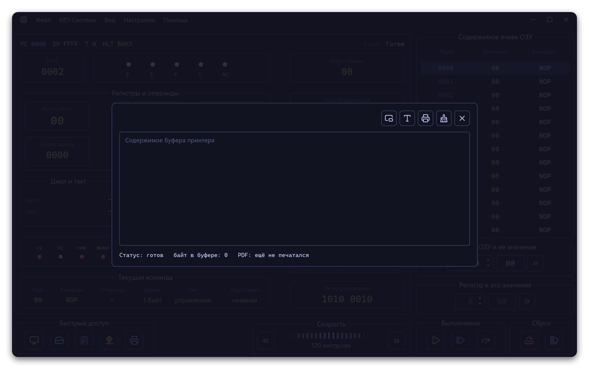

<p align="center">
  
</p>

<p align="center">
  <a href="https://github.com/WhoSowSee/KR580/graphs/contributors"></a>
  <a href="https://github.com/WhoSowSee/KR580/forks"></a>
  <a href="https://github.com/WhoSowSee/KR580/stargazers"></a>
</p>

<p align="center">
  <a href="https://crates.io/crates/kr580"></a>
  <a href="https://crates.io/crates/kr580"></a>
</p>

<h2 align="center">Настольный эмулятор КР580 на Rust</h2>

<p align="center">
  
</p>

> [!TIP]
> **English version:** [README-EN.md](README-EN.md)

KR580 — современный настольный эмулятор системы на КР580 / Intel 8080. Внутри — детерминированное ядро CPU, типизированные внешние устройства через I/O-порты и нативный многооконный интерфейс.

Проект сделан для наблюдаемого выполнения программ: можно редактировать ОЗУ и регистры, идти по командам или тактам, видеть живое обновление панелей управления, открывать окна внешних устройств, сохранять снимки и экспортировать состояние без чтения данных из UI-виджетов.

## Возможности

- Детерминированное состояние КР580 / Intel 8080: регистры, флаги, `PC`, `SP`, 64 КиБ ОЗУ, прерывания, `HLT`, счётчики циклов и тактовая фаза.
- Выполнение документированных 8080-опкодов с тестами семейств команд, флагов, условных переходов, стека, прерываний и маршрутизации I/O.
- Пошаговое выполнение по команде, выполнение по такту, регулируемый запуск и быстрый burst-режим.
- Нативный iced-интерфейс: список ОЗУ, редактор регистров, регистр состояния, схема машинных циклов, панель управления и локализованный установщик.
- Окна внешних устройств: монитор, дисковод, жёсткий диск, сетевой адаптер и принтер.
- Версионированные `.580`-снимки, загрузка сырых `.krs`-подпрограмм, прямой импорт/экспорт `.txt` / `.xlsx` и генерация PDF из буфера принтера.
- Графический установщик, деинсталлятор, терминальный launcher, опциональная ассоциация `.580` и portable/system-режимы установки.

## Скриншоты

<p align="center"><strong>Монитор</strong> · <strong>Дисковод</strong></p>
<p align="center">
  
  
</p>

<p align="center"><strong>Жёсткий диск</strong> · <strong>Сетевой адаптер</strong></p>
<p align="center">
  
  
</p>

<p align="center"><strong>Принтер</strong></p>
<p align="center">
  
</p>

## Внешние устройства

`IoBus` направляет младший байт адреса I/O-порта в пять моделируемых устройств:

| Порт | Устройство | Что делает |
|---:|---|---|
| `00h` | Монитор | Текстовый framebuffer 64×20 и графический слой 256×256. |
| `01h` | Дисковод | Файловое или debug-buffer хранилище с окном просмотра. |
| `02h` | HDD | Append-backed `hdd.kpd` и отдельный просмотр принятого буфера. |
| `03h` | Сетевой адаптер | TCP client/server worker, RX/TX-счётчики и явное состояние соединения. |
| `04h` | Принтер | CP866 spool, буфер вывода и асинхронный экспорт A4 PDF. |

Операции устройств возвращают типизированные статусы и ошибки. CPU обращается к ним только через `IN` / `OUT`, поэтому состояние эмулятора остаётся сериализуемым и тестируемым.

## Установка

### Требования

- Rust `1.95.0` или новее.
- Desktop-окружение, способное запускать нативные iced-окна.

### Установка из crates.io

```bash
cargo install kr580
```

Этот вариант рассчитан на опубликованный релиз в crates.io. Пока пакет не опубликован, используй сборку из исходников или standalone-установщик.

### Установка на NixOS

```bash
nix run github:WhoSowSee/KR580
nix profile install github:WhoSowSee/KR580
```

NixOS-пакет ставит готовые `k580` и `kr`, desktop entry, иконки и MIME-тип `.580` напрямую через Nix store. Standalone-установщик для этого сценария не используется.

### Запуск из исходников

```bash
git clone https://github.com/WhoSowSee/KR580.git
cd KR580
cargo run -p kr580 --bin k580
```

### Сборка GUI-бинарника

```bash
cargo build --release -p kr580 --bin k580
```

Готовое приложение появится в `target/release/` как `k580` или `k580.exe`.

### Сборка standalone-установщика

Windows:

```powershell
powershell -NoProfile -ExecutionPolicy Bypass -File scripts/build_installer.ps1
```

Unix/macOS:

```bash
bash scripts/build_installer.sh
```

Готовый установщик будет записан в `dist/`.

## Использование

```bash
# Запуск эмулятора из исходников
cargo run -p kr580 --bin k580

# Открыть snapshot через launcher
cargo run -p kr580 --bin kr -- path/to/program.580

# Показать справку launcher
cargo run -p kr580 --bin kr -- --help
```

После установки `kr` может открывать `.580`-снимки из терминала и регистрировать или удалять ассоциацию файлов там, где это поддерживает платформа.

## Форматы файлов

| Формат | Назначение |
|---|---|
| `.580` | Версионированный little-endian snapshot эмулятора с magic `K580`. |
| `.krs` | Сырые байты подпрограммы, загружаемые по указанному базовому адресу. |
| `.txt` | Текстовый экспорт регистров, флагов и памяти; также поддерживается импорт. |
| `.xlsx` | Импорт/экспорт workbook через `rust_xlsxwriter` и `calamine`. |
| `.pdf` | Вывод принтера в A4 с CP866-декодированием и встроенным Roboto Mono. |

## Структура workspace

| Crate | Ответственность |
|---|---|
| `k580-core` | Публичное ядро CPU: state, opcode decode/execute, timing, interrupts и `PortBus`. |
| `kr580` | Публичный installable crate: desktop UI, launcher, installer, uninstaller, platform shims и внутренние modules `backend`, `devices`, `persistence`. |

## Разработка

```bash
cargo fmt --all
cargo clippy --workspace --all-targets -- -D warnings
cargo test --workspace
```

Полезные документы:

- [Архитектура](docs/architecture.md)
- [Ядро CPU](docs/core.md)
- [Устройства и IoBus](docs/devices.md)
- [Сохранение данных](docs/persistence.md)
- [Приложение и UI](docs/ui_app.md)
- [Установщик](docs/installer.md)
- [Тестирование](docs/testing.md)
- [Ассеты](docs/assets.md)

## История звёзд

<p align="center">
  <a href="https://starchart.cc/WhoSowSee/KR580">
    <picture>
      <source
        media="(prefers-color-scheme: dark)"
        srcset="https://starchart.cc/WhoSowSee/KR580.svg?variant=custom&background=%230d1117&axis=%238b949e&line=%232f81f7"
      />
      <source
        media="(prefers-color-scheme: light)"
        srcset="https://starchart.cc/WhoSowSee/KR580.svg?variant=custom&background=%23ffffff&axis=%2357606a&line=%230969da"
      />
      
    </picture>
  </a>
</p>

<p align="center">
  
</p>

<p align="center">
  <i><code>&copy 2026-present <a href="https://github.com/WhoSowSee">WhoSowSee</a></code></i>
</p>

<div align="center">
  <a href="https://github.com/WhoSowSee/KR580/blob/main/LICENSE"></a>
</div>
