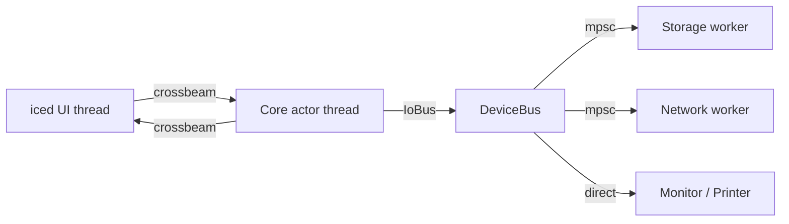

# Architecture

The application is split into six small crates inside one cargo workspace.
Each crate has one responsibility and a stable public surface.

## Workspace layout

```
crates/
├── kr580-core               # pure deterministic CPU
├── kr580-persistence        # .580 / .krs / settings / exports
├── kr580-devices            # IoBus and async peripheral workers
├── kr580-ui                 # iced view layer + core actor wiring
├── kr580-app                # binary: orchestration / DI
└── kr580-integration-tests  # workspace-level integration tests
```

## Layering rule

```
+-----------+
|    app    |   (binary, top-level wiring, no business logic)
+-----------+
|     ui    |   (iced views; renders state, dispatches commands)
+-----------+
|  devices  |   (IoBus + async device workers)
+-----------+
|  persistence  (snapshot / subprogram / settings / export)
+-----------+
|    core   |   (pure CPU; no I/O, no UI, no async)
+-----------+
```

* `core` knows about nothing else.
* `persistence` and `devices` depend on `core`.
* `ui` depends on `core`, `persistence`, `devices`.
* `app` depends on everything.

## Threading and runtime

The runtime, configured by `kr580-app/src/main.rs`:

1. starts a multi-threaded **Tokio runtime** for device workers;
2. builds a `DeviceBus` (the routing `IoBus`);
3. spawns the **core actor** on a dedicated thread (`kr580-ui/src/runtime.rs`);
4. hands off the iced UI thread.



Channels:

* `crossbeam_channel` for UI ↔ core actor (deterministic, lock-free, high
  throughput, no async overhead);
* `tokio::mpsc` inside each async device for queued I/O;
* `Arc<Mutex<...>>` only at the bus boundary, never inside the core itself.

## Determinism boundary

The CPU core is a *pure state machine*. All non-determinism (real time,
disk I/O, network) lives strictly outside `kr580-core`. The bus reads /
writes are observed at instruction boundaries; sub-instruction T-state
stepping (`step_tact`) is for debugging only and never invokes the bus.

## Data ownership

Per `prompt/01_architecture.md`:

| Owner             | What it owns                                                     |
| ----------------- | ---------------------------------------------------------------- |
| `Cpu8080State`    | registers, flags, RAM, PC, SP, halt, interrupt state, timing     |
| `DeviceBus`       | per-device worker handles, status counters                       |
| `Settings` / store| user preferences (versioned JSON)                                |
| iced application  | last known `StateView` snapshot + UI input drafts only           |
| iced widgets      | nothing emulator-relevant                                        |

The UI is forbidden from owning emulator state; it holds an
`Arc<StateView>` and re-reads authoritative data over the channel.

## Error model

* `kr580-core::CoreError` — typed CPU errors (`Decode`, `Validation`, `Halted`).
* `kr580-persistence::{SnapshotError, ExportError, PersistenceError}` —
  versioned format errors.
* `kr580-devices::DeviceError` — `NotReady`, `Busy`, `Timeout`,
  `Disconnected`, `PathNotFound`, `PermissionDenied`, `Io`, `Protocol`.

There are no string-typed errors in public APIs.
